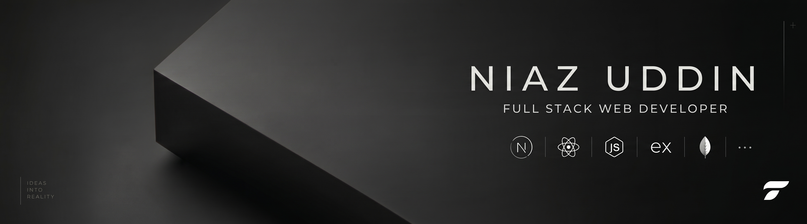

<!-- ==================== Header Banner ==================== -->

  
  
  
  
  

  

    
    &nbsp;
    
    &nbsp;
    
    &nbsp;
    
    &nbsp;
    
    &nbsp;
    
  

---

## 👨‍💻 About Me

I'm a dedicated full-stack web developer passionate about building clean, high-performance, and user-friendly digital experiences. With expertise across **React, Next.js, Node.js, Express, and modern cloud technologies**, I help transform ideas and design concepts into fast, scalable, and intuitive web applications.

- 💼 **Expertise**: Full-Stack Web Development, Responsive UI/UX Architecture, & RESTful APIs
- 🚀 **Core Technologies**: React, Next.js, Node.js, Express, MongoDB, Tailwind CSS
- 🌐 **Live Portfolio**: [web.tanimcoding.workers.dev](http://web.tanimcoding.workers.dev/)
- 📁 **Featured Projects**: [Explore my project portfolio](https://niaz-uddin-portfolio.vercel.app/projects)
- 📍 **Location**: Bangladesh 🇧🇩 *(Open for worldwide remote opportunities & collaborations)*
- ⚡ **Core Values**: Clean maintainable code, optimal performance, and great user experience

---

## 🚀 What I Do

<table>
  <tr>
    <td width="33%" valign="top">
      <h3 align="center">🎨 Frontend Architecture</h3>
      

        Crafting sleek, accessible, and high-performance interfaces with <b>React, Next.js, Tailwind CSS, Framer Motion & DaisyUI</b>.
      

    </td>
    <td width="33%" valign="top">
      <h3 align="center">⚙️ Backend & APIs</h3>
      

        Designing scalable server-side systems, RESTful microservices, and databases with <b>Node.js, Express & MongoDB</b>.
      

    </td>
    <td width="33%" valign="top">
      <h3 align="center">🔒 Auth & Cloud</h3>
      

        Implementing secure authentication workflows with <b>Auth.js, Better Auth, Firebase, JWT</b> and cloud deployment.
      

    </td>
  </tr>
</table>

---

## 🛠️ Tech Stack & Ecosystem

| Category | Tools & Technologies |
| :--- | :--- |
| **Frontend** |         |
| **Styling & UI** |    |
| **Backend** |    |
| **Databases** |  |
| **APIs & Data** |  |
| **Auth & Cloud** |     |
| **Version Control** |   |

 

---

## 📊 GitHub Activity & Analytics

  
  &nbsp;&nbsp;
  

Stats update automatically with your latest commits • Styled in TokyoNight Dark Theme

  

<!-- ==================== Footer ==================== -->

  

